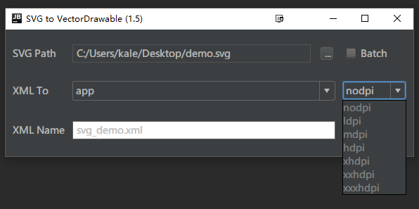
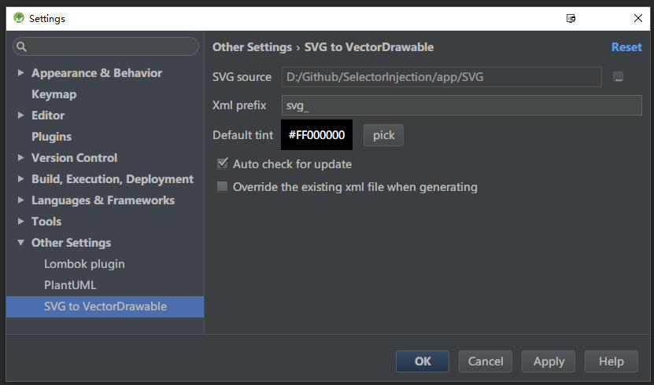

##SVG2VectorDrawable  

  

README:
[中文](https://github.com/misakuo/svgtoandroid/blob/master/readme.md) | [English](https://github.com/misakuo/svgtoandroid/blob/master/readme_en.md)

### 简介
Intellij Platform插件，通过其可以完成从svg文件到Android VectorDrawable的自动化转换。

### 特性
 - 图形化界面
 - 自动解析当前Project，如果当前Project为Android Project，则会列出所有Module   
 - 支持将SVG解析为多种dpi的VectorDrawable  
 - 支持SVG的transform属性
 - 支持批量转换指定目录内的所有svg文件

### 属性对应表
|SVG Attribute|VectorDrawable Attribute|
|:-:|:-:|
|id|android:name|
|fill|android:fillColor|
|fill-opacity|android:fillAlpha|
|fill-rule|android:fillType|
|stroke|android:strokeColor|
|stroke-opacity|android:strokeAlpha|
|stroke-width|android:strokeWidth|
|stroke-linejoin|android:strokeLineJoin|
|stroke-miterlimit|android:strokeMiterLimit|
|stroke-linecap|android:lineCap|
|transform|android:{scaleX/Y \| translateX/Y \| pivotX/Y \| rotation}|

### 使用
#### 安装  
本插件支持Intellij IDEA和Android Studio，需要JDK版本1.6+  
##### 通过本地jar文件安装
[从此处](https://github.com/misakuo/svgtoandroid/blob/master/svg2android.zip) 下载`svg2android.zip` 文件，在IDE中打开 Preferences -> Plugins -> Install plugin from disk... 选择 svg2android.zip ，添加后重启IDE
##### 通过插件仓库在线安装
在IDE中打开Preferences -> Plugins -> Browse Repositories，搜索SVG2VectorDrawable，安装插件并重启IDE
#### 界面  

#### 用法
##### GUI模式

- 点击`···`按钮，选择一个SVG源文件，或勾选`batch`，并点击`···`选择一个包含svg文件的目录
- 在第一个下拉选框中选中要生成xml文件的module，在第二个选框中选择生成的VectorDrawable的分辨率
- 填入生成xml文件的文件名，默认为vector_drawable_ + SVG文件的名称
- 点击`Generate`，插件会生成出VectorDrawable并在编辑器中打开（默认覆盖同名文件）

注意：在module中已存在的分辨率目录为黑色字体，未存在的目录为灰色字体，如果选中不存在的目录，则插件会自动生成该目录。    

##### Generate模式    

- 在任意代码编辑器窗口中呼出`Generate`菜单（例如macOS默认是control+enter）
- 选择`VectorDrawable`，插件会将指定目录中的所有svg文件转换到当前module的drawable目录中（默认跳过同名文件）

#### 设置项
打开`Prefreences -> Other Settings`，选择`SVG to VectorDrawable`，打开设置面板   

- SVG source： 设置存放svg文件的默认目录，在Generate模式中将会从该目录获取svg文件    
- Xml prefix： 设置生成的xml文件名的默认前缀    
- Auto check for update： 勾选后在每次打开GUI的时候会进行自动版本更新检查操作    
- Override the existing xml file when generating： 勾选后在生成过程中将会覆盖已存在的同名文件

#### 更新日志    
##### 1.5    
支持fill-rule属性（该属性目前仅被API 24+支持）    
添加Generate模式    
支持批量生成
##### 1.4.2    
针对Sketch导出的SVG文件做了优化    
##### 1.4.1    
代码优化，更换新Icon
##### 1.4.0
支持“transform”属性
##### Early
创建项目，bug fix    

*欢迎提交Issue和PR*
***
Reference: [svg2vectordrawable](https://github.com/Ashung/svg2vectordrawable)
