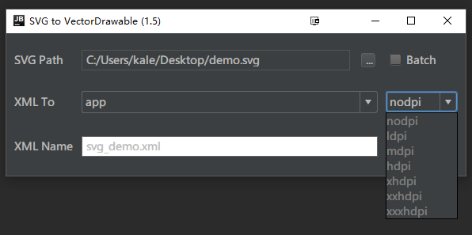

## SVG2VectorDrawable
[中文](https://github.com/misakuo/svgtoandroid/blob/master/readme.md)
***
### About
SVG2VectorDrawable, an plugin to Intellij platform, provides an automatic tool to convert svg file to Android VectorDrawable.

### Features
- Graphical user interface  
- Parse Android Project and list all Modules  
- Support the parsing from SVG into VectorDrawable of different dpi  
- Support SVG transform attribute  
- Support batch operations of SVG convertion in a specified directory  

### Attributes Contrast

|SVG Attribute|VectorDrawable Attribute|
|:-:|:-:|
|id|android:name|
|fill|android:fillColor|
|fill-opacity|android:fillAlpha|
|stroke|android:strokeColor|
|stroke-opacity|android:strokeAlpha|
|stroke-width|android:strokeWidth|
|stroke-linejoin|android:strokeLineJoin|
|stroke-miterlimit|android:strokeMiterLimit|
|stroke-linecap|android:lineCap|
|transform|android:{scaleX/Y \| translateX/Y \| pivotX/Y \| rotation}|

### Useage

#### Install  
This plugin is supporting to Intellij IDEA and Android Studio, need JDK1.6 and higher.    

##### Installing from jar file
[Click to download](https://github.com/misakuo/svgtoandroid/raw/master/SVG2VectorDrawable.jar) file `SVG2VectorDrawable.jar`, open `Preferences -> Plugins -> Install plugin from disk...` in IDE, choosing `SVG2VectorDrawable.jar`, you can find plugin's icon in toolbar after restart IDE.   

##### Installing from plugin repo
In IDE,open `Preferences -> Plugins -> Browse Repositories`, search `SVG2VectorDrawable`, install and restart IDE.

#### Under GUI  

- Click`...` and select SVG source file or selec batch and select a directory with SVG files in it
- Choose module from which you want to generate XML file in the first combobox. If the dpi dir (like `drawable-xxhdpi`) is already exists, the fontcolor in combox is BLACK, else the fontcolor is GRAY. If choosed dir not exists, plugin will creating the dir
- Choose DPI for VectorDrawable to be generated in the second combobox
- Fill the name of the xml to be generated and file name is `{vector_drawable+SVG_NAME}` by default  
- Click`Generate`and this plugin will create VectorDrawabble and open it in an editor(if xml file existed before generating,the content will be overwitten)

#### Under Generate
  
Call Generate Menu in any main code editor. Example, `control+enter` in macOS
.This plugin will convert SVG file under specified directory into drawable directory of current module skipping files with the same name.

***
Welcome to commit issue & PR :)
